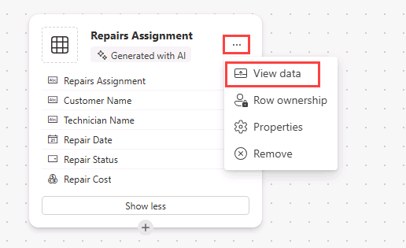

---
lab:
  title: 'Lab 1: Erstellen einer Canvas-App aus Daten'
  module: 'Module 1: Get started with Power Apps canvas apps'
---

# Übungslab 1: Erstellen einer Canvas-App aus Daten

In diesem Lab entwerfen und erstellen Sie eine Canvas-App aus einer vorhandenen Datenquelle.

## Lernziele

- Erstellen von Power Apps-Canvas-Apps aus Daten und mit Copilot
- Verknüpfen mit Excel als Datenquelle mithilfe von OneDrive for Business

## Weiterführende Schritte des Lab

- Erstellen einer Canvas-App aus Daten
- Testen der App
- Erstellen einer Canvas-App mit Copilot
  
## Voraussetzungen

- Sie müssen Folgendes abgeschlossen haben: **Lab 0: Überprüfen der Labumgebung**

## Ausführliche Schritte

## Übung 1: Abrufen der Daten

### Aufgabe 1.1: Herunterladen des Excel-Arbeitsblatts

1. Navigieren Sie zu [CoffeeMachineData.xlsx](https://github.com/MicrosoftLearning/PL-7001-Create-and-manage-canvas-apps-with-Power-Apps/blob/master/Allfiles/Labs/CoffeeMachineData.xlsx).

1. Wählen Sie die Schaltfläche **Rohdatendatei** aus, um die Excel-Arbeitsmappe herunterzuladen.

    

### Aufgabe 1.2: Hochladen in OneDrive for Business

1. Wählen Sie im [Power Apps Maker-Portal](https://make.powerapps.com) das **App-Startfeld** oben links im Browserfenster und dann **OneDrive** aus.

    

1. Wenn ein Popupelement angezeigt wird, wählen Sie **Ihr OneDrive ist bereit** aus.

1. Wählen Sie **+ Erstellen oder hochladen** und anschließend **Dateien hochladen** aus.

    

1. Navigieren Sie zum **Downloads**-Ordner, wählen Sie die Datei **CoffeeMachineData.xlsx** aus und klicken Sie auf **Öffnen**.

1. Wählen Sie **Meine Dateien** aus, und überprüfen Sie, ob „CoffeeMachineData.xlsx“ hochgeladen wurde.

## Übung 2 – Erstellen einer Canvas-App aus Daten

### Aufgabe 2.1: Erstellen der App

1. Navigieren Sie zum Power Apps Maker-Portal unter <https://make.powerapps.com>.

1. Vergewissern Sie sich, dass Sie sich in der Umgebung **Dev One** befinden.

1. Wählen Sie im linken Menü die Registerkarte **+ Erstellen** aus.

1. Wählen Sie die Kachel **Mit Daten beginnen** unter **Apps erstellen**.

    

1. Wählen Sie die Kachel **Externe Daten verbinden** unter **Weitere Möglichkeiten, um loszulegen**.

    

1. Wählen Sie die Kachel **Mit Excel** unter **Datensatz zum Starten auswählen**.

    

1. Nach einer kurzen Wartezeit wird automatisch eine Verbindung zu **Excel Online (Business)** hergestellt.

1. Erweitern Sie unter **Tabelle auswählen** den Eintrag **OneDrive for Business**.

1. Erweitern Sie **OneDrive**.

1. Erweitern Sie die **CoffeeMachineData.xlsx**-Excel-Datei.

1. Wählen Sie die Tabelle **CoffeeMachines** aus.

    

1. Wählen Sie **App erstellen** aus.

1. Wenn das Popupdialogfeld **Willkommen bei Power Apps Studio** angezeigt wird, wählen Sie **Nicht mehr anzeigen** und dann **Überspringen** aus.

1. Warten Sie, bis die App erstellt wurde.

    

1. Wählen Sie **Speichern** oben rechts in Power Apps Studio aus, geben Sie `Coffee Machines App` ein, und wählen Sie erneut **Speichern** aus.

### Aufgabe 2.2: Testen der App

1. Wählen Sie das Symbol **App in der Vorschau anzeigen (F5)** oben rechts in Power Apps Studio.

1. Wählen Sie eine beliebige Maschine im Katalog aus. Dadurch werden Details des Computers im Formular angezeigt.

1. Wählen Sie oben rechts in der App das Symbol **Bearbeiten** aus.

1. Ändern Sie den **Maschinenpreis** wählen Sie das **Häkchensymbol** oben rechts in der App.

1. Wählen Sie das Symbol **+ Neu** oben links in der App aus.

1. Geben Sie `abcde` als Maschinen-ID ein.

1. Geben Sie `Demo Machine` als **Maschinenname** ein.

1. Geben Sie `999` als **Maschinenpreis** ein.

1. Wählen Sie das **Häkchensymbol** oben rechts in der App.

1. Wählen Sie das **X** in der oberen rechten Ecke aus, um die Vorschau zu beenden.

1. Wenn das Popupdialogfeld **Schon gewusst...?** angezeigt wird, wählen Sie **Nicht mehr anzeigen** und dann **OK** aus.

1. Wählen Sie oben links in der Befehlsleiste die Schaltfläche **<- Zurück** und dann **Verlassen** aus, um die App zu beenden.

## Übung 3: Erstellen einer Canvas-App mit Copilot

### Aufgabe 3.1: Erstellen der App

1. Navigieren Sie zum Power Apps Maker-Portal `https://make.powerapps.com`.

1. Stellen Sie sicher, dass Sie sich in der Umgebung **Dev One** befinden.

1. Wählen Sie im linken Menü die Registerkarte **+ Erstellen** aus.

1. Wählen Sie die Kachel **Mit Copilot beginnen** unter **Apps erstellen**.

1. Geben Sie unter **Mit Copilot beginnen** `Assign coffee repairs to technicians per customer request` ein.

    

1. Wählen Sie das Symbol **Tabellenoptionen** und wählen Sie **Eine Tabelle**.

    

1. Wählen Sie **Generieren** aus.

    Copilot beginnt mit der Erstellung einer Tabellenstruktur zur Unterstützung Ihrer Anwendung.

    > **WICHTIG:** Wenn Sie generative KI verwenden, erhalten Sie nicht immer dieselben genauen Ergebnisse. Es ist möglich, dass Ihre Tabelle nicht genau mit der Tabelle übereinstimmt, die für einen anderen Kursteilnehmer erstellt wurde.

1. Wählen Sie die **Befehle (...)** neben der Tabelle und wählen Sie **Daten anzeigen** aus.

    

1. Überprüfen der Tabelle

    

1. Wenn Sie mit Ihrer Tabelle zufrieden sind, wählen Sie die Schaltfläche **Speichern und App öffnen**.

1. Falls erforderlich, wählen Sie auf dem Bildschirm **Arbeit abgeschlossen?** die Option **Nicht mehr nachfragen** aus und wählen Sie die Schaltfläche **App speichern und öffnen** aus.

1. Warten Sie, bis die App erstellt wurde.

    

1. Wählen Sie **Speichern** oben rechts in Power Apps Studio aus, geben Sie `Coffee Machine Repairs App` ein, und wählen Sie erneut **Speichern** aus.

1. Wählen Sie oben links in der Befehlsleiste die Schaltfläche **<- Zurück** und dann **Verlassen** aus, um die App zu beenden.

1. Wählen Sie im linken Menü des Power Apps Maker-Portals die Registerkarte **Apps** aus.
