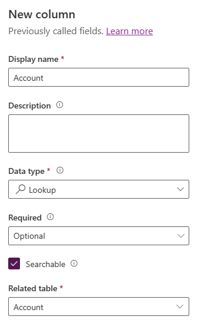

---
lab:
  title: "Lab\_2: Datenmodell"
  module: 'Module 2: Get started with Microsoft Dataverse'
---

# Übungslab 2: Datenmodell

In diesem Lab erstellen Sie Dataverse-Tabellen und -Spalten.

## Lernziele

- Gewusst wie: Erstellen von Tabellen und Spalten in Microsoft Dataverse
- Gewusst wie: Erstellen einer Beziehung mit einer Lookupspalte

## Weiterführende Schritte des Lab

- Eine benutzerdefinierte Tabelle erstellen
- Einer Tabelle Spalten hinzufügen
- Erstellen einer Beziehung mithilfe einer Lookupspalte
  
## Voraussetzungen

- Sie müssen Folgendes abgeschlossen haben: **Lab 0: Überprüfen der Labumgebung**

## Ausführliche Schritte

## Übung 1: Erstellen benutzerdefinierter Tabellen

### Aufgabe 1.1: Erstellen der Tabelle „Booking Request“

1. Navigieren Sie zum Power Apps Maker-Portal `https://make.powerapps.com`.

1. Stellen Sie sicher, dass Sie sich in der Umgebung **Dev One** befinden.

1. Wählen Sie im linken Navigationsbereich **Tabellen** aus.

1. Wählen Sie **+ Neue Tabelle**, und wählen Sie **Erweiterte Eigenschaften festlegen**.

    

1. Geben Sie für **Anzeigename** `Booking Request` ein.

### Aufgabe 1.2: Primäre Spalte

1. Wählen Sie die Registerkarte **Primäre Spalte** neben der Registerkarte **Eigenschaften** aus.

    

1. Geben Sie für **Anzeigename** `Pet Name` ein.

1. Wählen Sie **Speichern**.

### Aufgabe 1.3: Hinzufügen von Spalten

1. Wählen Sie im Bereich **Spalten und Daten von Booking Request** **+** aus, um eine neue Spalte hinzuzufügen.

    

1. Geben Sie im Bereich **Neue Spalte** die folgenden Werte ein, oder wählen Sie diese aus:

   1. Anzeigename: `Owner Name`
   1. Datentyp: **Einzelne Textzeile**
   1. Erforderlich: **Business erforderlich**

    

1. Wählen Sie **Speichern**.

1. Wählen Sie im Bereich **Spalten und Daten von Booking Request** **+** aus, um eine neue Spalte hinzuzufügen.

1. Geben Sie im Bereich **Neue Spalte** die folgenden Werte ein, oder wählen Sie diese aus:

   1. Anzeigename: `Owner Email`
   1. Datentyp: **Einzelne Textzeile**
   1. Format: **E-Mail**
   1. Erforderlich: **Business erforderlich**

1. Wählen Sie **Speichern**.

1. Wählen Sie im Bereich **Spalten und Daten von Booking Request** **+** aus, und geben Sie im Bereich **Neue Spalte** die folgenden Werte ein, oder wählen Sie diese aus:

   1. Anzeigename: `Start Date`
   1. Datentyp: **Datum und Uhrzeit**
   1. Erforderlich: **Business erforderlich**

1. Wählen Sie **Speichern**.

1. Wählen Sie im Bereich **Spalten und Daten von Booking Request** **+** aus, und geben Sie im Bereich **Neue Spalte** die folgenden Werte ein, oder wählen Sie diese aus:

   1. Anzeigename: `End Date`
   1. Datentyp: **Datum und Uhrzeit**
   1. Erforderlich: **Optional**

1. Wählen Sie **Speichern**.

1. Wählen Sie im Bereich **Spalten und Daten von Booking Request** **+** aus, und geben Sie im Bereich **Neue Spalte** die folgenden Werte ein, oder wählen Sie diese aus:

   1. Anzeigename: `Cost`
   1. Datentyp: **Währung**
   1. Erforderlich: **Optional**

1. Wählen Sie **Speichern**.

1. Wählen Sie im Bereich **Spalten und Daten von Booking Request** **+** aus, und geben Sie im Bereich **Neue Spalte** die folgenden Werte ein, oder wählen Sie diese aus:

   1. Anzeigename: `Notes`
   1. Datentyp: **Mehrere Textzeilen**
   1. Format: **Text**
   1. Erforderlich: **Optional**

1. Wählen Sie **Speichern**.

### Aufgabe 1.4: Hinzufügen einer Auswahlspalte

1. Wählen Sie im Bereich **Spalten und Daten von Booking Request** **+** aus, und geben Sie im Bereich **Neue Spalte** die folgenden Werte ein, oder wählen Sie diese aus:

   1. Anzeigename: `Decision`
   1. Datentyp: **Auswahl**
   1. Erforderlich: **Optional**

1. Wählen Sie **Nein** für **Mit globaler Auswahl synchronisieren?** aus.

1. Geben Sie `Undecided` für **Bezeichnung** ein, und geben Sie `1` für **Wert** ein.

1. Wählen Sie **+ Neue Auswahl** aus, und geben Sie `Accepted` für **Bezeichnung** sowie `2` für **Wert** ein.

1. Wählen Sie **+ Neue Auswahl** aus, und geben Sie `Declined` für **Bezeichnung** sowie `3` für **Wert** ein.

1. Wählen Sie **Nicht festgelegt** für **Standardauswahl** aus.

    

1. Wählen Sie **Speichern**.

## Übung 2: Erstellen einer Beziehung

### Aufgabe 2.1: Erstellen einer Lookupspalte

1. Navigieren Sie zum Power Apps Maker-Portal `https://make.powerapps.com`.

1. Stellen Sie sicher, dass Sie sich in der Umgebung **Dev One** befinden.

1. Wählen Sie im linken Navigationsbereich **Tabellen** aus.

1. Wählen Sie **Buchungsanfrage** aus.

1. Wählen Sie im Bereich **Spalten und Daten von Booking Request** **+** aus, und geben Sie im Bereich **Neue Spalte** die folgenden Werte ein, oder wählen Sie diese aus:

   1. Anzeigename: `Account`
   1. Datentyp: **Suche**
   1. Erforderlich: **Optional**
   1. Verwandte Tabelle: **Konto**

    

1. Wählen Sie **Speichern**.

## Übung 3: Daten

### Aufgabe 3.1 – Hinzufügen von Buchungsanfragedatensätzen

1. Navigieren Sie zum Power Apps Maker-Portal unter <https://make.powerapps.com>.

1. Stellen Sie sicher, dass Sie sich in der Umgebung **Dev One** befinden.

1. Wählen Sie im linken Navigationsbereich **Tabellen** aus.

1. Wählen Sie **Buchungsanfrage** aus.

1. Wählen Sie im Bereich **Spalten und Daten der Buchungsanfrage** das Dropdown-Kreuz neben **Bearbeiten** und wählen Sie **In neuer Registerkarte bearbeiten** aus.

1. Geben Sie die folgenden Werte ein bzw. wählen Sie diese aus.

   1. Name des Haustiers: `Fido`
   1. Name des Besitzers: `MOD Administrator`
   1. E-Mail des Besitzers: Verwenden Ihrer Mandanten-E-Mail
   1. Startdatum: **Morgen**
   1. Enddatum: **Auswählen eines Datums in der folgenden Woche**
   1. Kosten: `1,000`
   1. Entscheidung: **Akzeptiert**

1. Wählen Sie **Zeile unterhalb einfügen** aus, und geben Sie die folgenden Werte ein, oder wählen Sie sie aus:

   1. Name des Haustiers: `Tom`
   1. Name des Besitzers: `MOD Administrator`
   1. E-Mail des Besitzers: Verwenden Ihrer Mandanten-E-Mail
   1. Startdatum: **Auswählen eines Datums im nächsten Monat**
   1. Enddatum: **Auswählen eines Datums nach dem Startdatum**
   1. Kosten: `1,500`
   1. Entscheidung: **Weiß nicht**

1. Wählen Sie **Zeile unterhalb einfügen** aus, und geben Sie die folgenden Werte ein, oder wählen Sie sie aus:

   1. Name des Haustiers: `Jim`
   1. Name des Besitzers: `MOD Administrator`
   1. E-Mail des Besitzers: Verwenden Ihrer Mandanten-E-Mail
   1. Startdatum: **Zukünftiges Datum im aktuellen Monat auswählen**
   1. Enddatum: **Auswählen eines Datums nach dem Startdatum**
   1. Kosten: `250`
   1. Entscheidung: **Abgelehnt**

1. Schließen Sie die Registerkarte „Daten bearbeiten“.

