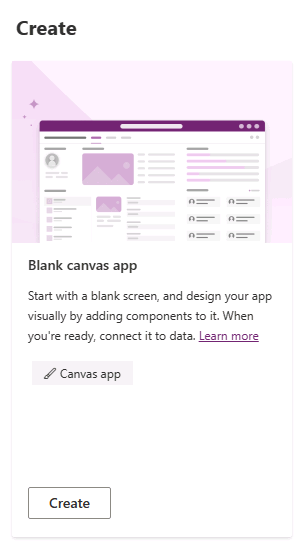
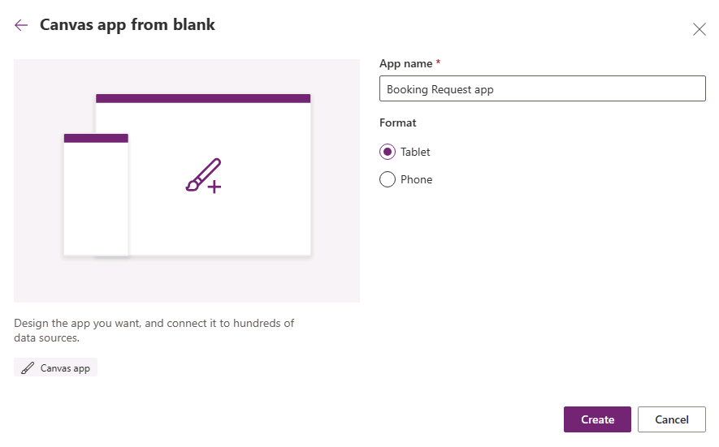
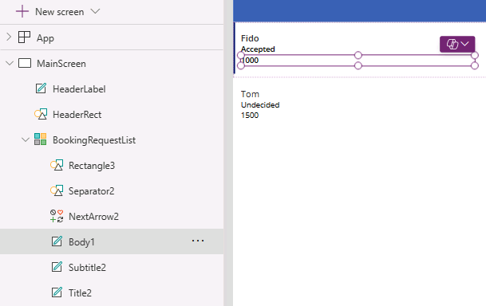

---
lab:
  title: "Lab\_3: Eine Canvas-App erstellen"
  module: 'Module 3: Customize a canvas app in Power Apps'
---

# Übungslab 3 – Erstellen einer Canvas-App

In diesem Lab entwerfen und erstellen Sie eine Canvas-App aus einer leeren App und fügen dann eine Datenquelle und einen Katalog hinzu.

## Lernziele

- Erstellen einer Canvas-App mit einem Katalog, der mit einer Datenquelle verknüpft ist
- Formatieren von Feldern mit Power Fx-Formeln

## Weiterführende Schritte des Lab

- Erstellen Sie eine Canvas App ohne Vorlage
- Hinzufügen einer Datenquelle zur App
- Hinzufügen eines Katalogs zur App
- Konfigurieren der Felder im Katalog
  
## Voraussetzungen

- Sie müssen **Lab 2: Datenmodell** abgeschlossen haben

## Ausführliche Schritte

## Übung 1 – Erstellen einer Canvas-App

### Aufgabe 1.1 – Erstellen der App

1. Navigieren Sie zum Power Apps Maker-Portal <https://make.powerapps.com>.

1. Vergewissern Sie sich, dass Sie sich in der Umgebung **Dev One** befinden.

1. Wählen Sie im linken Menü die Registerkarte **+ Erstellen** aus.

1. Wählen Sie die Kachel **Leere App** unter **Beginnen ab** aus.

    

1. Wählen Sie **Erstellen** unter der Kachel **Leere Canvas-App** aus.

1. Geben Sie `Booking Request app` als **App-Name** ein.

1. Wählen Sie **Tablet** als **Format** aus.

    

1. Klicken Sie auf **Erstellen**.

1. Warten Sie, bis die App erstellt wurde.

1. Wählen Sie oben rechts in Power Apps Studio **Speichern** aus.

### Aufgabe 1.2 – Hinzufügen einer Datenquelle

1. Wählen Sie im App-Erstellungsmenü **Daten** aus.

    

1. Wählen Sie das Dropdown-Caret neben **Daten hinzufügen** aus und geben Sie `Booking` in **Suche** ein.

    

1. Wählen Sie die Microsoft Dataverse-Tabelle **Buchungsanfragen** aus.

### Aufgabe 1.3 – Konfigurieren des Hauptbildschirms

1. Wählen Sie im Menü für die App-Erstellung **Strukturansicht** aus.

1. Wählen Sie **Screen1** in der Strukturansicht, die Auslassungspunkte (**…**) und dann **Umbenennen** aus.

1. Geben Sie `MainScreen` ein.

1. Wählen Sie im Menü für die App-Erstellung **Einfügen (+)** aus.

1. Wählen Sie **Rechteck** aus.

1. Ziehen Sie das Rechteck auf die obere linke Seite des Bildschirms.

1. Wählen Sie im Menü für die App-Erstellung **Strukturansicht** aus.

1. Benennen Sie das Rechteck in `HeaderRect` um.

1. Legen Sie die Eigenschaften des Rechtecks in der Bearbeitungsleiste wie folgt fest:

   1. X = `0`
   1. Y=`0`
   1. Höhe = `80`
   1. Breite=`Parent.Width`

1. Wählen Sie im Menü für die App-Erstellung **Einfügen (+)** aus.

1. **Textbeschriftung** auswählen.

1. Ziehen Sie die Bezeichnung oben links auf den Bildschirm.

1. Wählen Sie im Menü für die App-Erstellung **Strukturansicht** aus.

1. Benennen Sie die Beschriftung in `HeaderLabel` um.

1. Legen Sie die Eigenschaften der Beschriftung in der Bearbeitungsleiste wie folgt fest:

   1. X = `0`
   1. Y=`0`
   1. Höhe = `80`
   1. Breite=`Parent.Width`
   1. Ausrichtung=`Align.Center`
   1. Größe=`24`
   1. Text=`"Booking Request"`
   1. Farbe=`Color.White`

    

1. Wählen Sie oben rechts in Power Apps Studio **Speichern** aus.

### Aufgabe 1.4 – Hinzufügen eines Katalogs

1. Wählen Sie im Menü für die App-Erstellung **Einfügen (+)** aus.

1. Wählen Sie **Vertikaler Katalog**.

    

1. Wählen Sie **Buchungsanfragen** für die Datenquelle aus.

    

1. Wählen Sie **Titel, Untertitel und Textkörper** für **Layout** aus.

1. Wählen Sie **7 ausgewählt** neben **Felder** aus.

1. Wählen Sie **Kosten** für **Textkörper** aus.

1. Wählen Sie **Entscheidung** für **Untertitel** aus.

1. Wählen Sie **Name des Haustiers** für **Titel** aus.

    

1. Schließen Sie den Bereich Daten.

1. Wählen Sie im Menü für die App-Erstellung **Strukturansicht** aus.

1. Ändern Sie den Namen des Katalogs in `BookingRequestList`.

1. Legen Sie die Eigenschaften des Katalogs in der Bearbeitungsleiste wie folgt fest:

   1. X = `0`
   1. Y = `80`
   1. Höhe = `575`
   1. Breite=`250`

### Aufgabe 1.5 – Formatieren des Währungsfelds

1. Wählen Sie im Menü für die App-Erstellung **Strukturansicht** aus.

1. Erweitern Sie den Katalog.

1. Wählen Sie den Textkörper aus.

    

1. Legen Sie die **Texteigenschaft** in der Bearbeitungsleiste auf die Formel fest:

    ```powerappsfl
    Text(Value(ThisItem.Cost), "$#,##0.00")
    ```

1. Wählen Sie oben rechts in Power Apps Studio die Option **Speichern** aus.

1. Wählen Sie oben links in der Befehlsleiste die Schaltfläche **<- Zurück** und dann **Verlassen** aus, um die App zu beenden.
