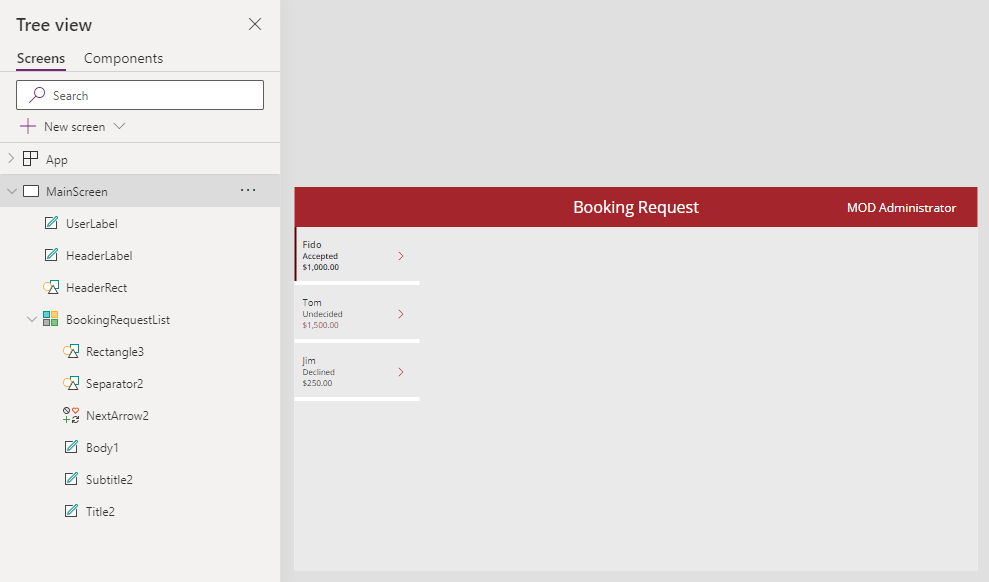

---
lab:
  title: "Lab\_4: Erstellen der Benutzeroberfläche"
  module: 'Module 4: How to build the UI in a canvas app in Power Apps'
---

# Übungslab 4: Erstellen der Benutzeroberfläche

In diesem Lab ändern Sie die Farben der Steuerelemente in der App.

## Lernziele

- Verwenden von Designs
- Personalisieren der App

## Weiterführende Schritte des Lab

- Design wählen
- Personalisierung
  
## Voraussetzungen

- Sie müssen **Lab 3: Erstellen einer Canvas-App** abgeschlossen haben.

## Ausführliche Schritte

## Übung 1: Design

### Aufgabe 1.1: Bearbeiten der App

1. Navigieren Sie zum Power Apps Maker-Portal <https://make.powerapps.com>.

1. Stellen Sie sicher, dass Sie sich in der Umgebung **Dev One** befinden.

1. Wählen Sie im linken Menü die Registerkarte **Apps** aus.

1. Wählen Sie die **Buchungsanfrage-App**, die Befehle (**...**) und dann **Bearbeiten > Auf der neuen Registerkarte bearbeiten** aus.

### Aufgabe 1.2: Auswählen einer Vorlage

1. Wählen Sie auf der Aktionsleiste in Power Apps Studio **Design**aus.

    

1. Wählen Sie das Design **Rot** aus.

### Aufgabe 1.3: Festlegen des Brandings für Steuerelemente

1. Wählen Sie im Menü für die App-Erstellung **Strukturansicht** aus.

1. Erweitern Sie den Katalog **BookingRequestList**.

1. Wählen Sie **WeiterPfeil2** aus.

1. Legen Sie die **Color**-Eigenschaft von NextArrow in der Bearbeitungsleiste auf Folgendes fest:

    ```powerappsfl
    RGBA(164, 38, 44, 1)
    ```

1. Wählen Sie **Textkörper1** aus.

1. Legen Sie die **Color**-Eigenschaft des Textkörpers in der Bearbeitungsleiste auf Folgendes fest:

    ```powerappsfl
    If(ThisItem.Cost > 1000, RGBA(164, 38, 44, 1), Color.Black)
    ```

1. Wählen Sie oben rechts in Power Apps Studio **Speichern** aus.


## Übung 2: Personalisierung

### Aufgabe 2.1: Hinzufügen einer Benutzerbezeichnung

1. Klicken Sie außerhalb des Katalogs im leeren Canvas-Panel, oder wählen Sie **Hauptbildschirm** aus.

1. Wählen Sie im Menü für die App-Erstellung **Einfügen (+)** aus.

1. **Textbeschriftung** auswählen.

1. Ziehen Sie die Bezeichnung oben rechts auf den Bildschirm.

1. Wählen Sie im Menü für die App-Erstellung **Strukturansicht** aus.

1. Benennen Sie die Beschriftung in `UserLabel` um.

1. Legen Sie die Eigenschaften der Beschriftung in der Bearbeitungsleiste wie folgt fest:

   1. X = `1100`
   1. Y = `20`
   1. Höhe = `40`
   1. Breite=`250`
   1. Ausrichtung=`Align.Right`
   1. Size=`18`
   1. PaddingRight=`10`
   1. Color=`Color.White`
   1. Text=`User().FullName`

    

1. Wählen Sie oben rechts in Power Apps Studio **Speichern** aus.

1. Wählen Sie oben links in der Befehlsleiste die Schaltfläche **<- Zurück** und dann **Verlassen** aus, um die App zu beenden.
