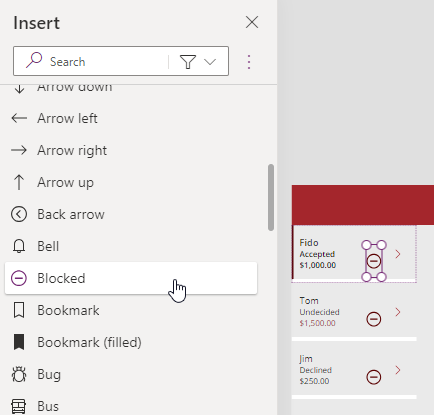

---
lab:
  title: "Lab\_5: Externe Daten"
  module: 'Module 5: Work with external data in a Power Apps canvas app'
---

# Übungslab 5: – Externe Daten

In diesem Lab fügen Sie eine externe Datenquelle hinzu.

## Lernziele

- So fügen Sie Ihrer Canvas-App eine SharePoint-Liste hinzu
- So verwenden Sie Sammlungen
- So verwenden Sie Patch
- So verwenden Sie den Office365Users-Konnektor

## Weiterführende Schritte des Lab

- Erstellen einer SharePoint-Liste für Buchungen
- Hinzufügen der SharePoint-Liste als Katalog
- Speichern ausgewählter Datensätze aus einem Katalog
- Verwenden von Patch zum Festlegen der Entscheidung für eine Buchungsanfrage
- Verwenden Sie den Office365User-Konnektor, um die Benutzerdetails anzuzeigen.
  
## Voraussetzungen

- Sie müssen Folgendes abgeschlossen haben: **Lab 4: Erstellen der Benutzeroberfläche**

## Ausführliche Schritte

## Übung 1: Erstellen einer SharePoint-Liste

### Aufgabe 1.1 Erstellen einer SharePoint-Website

1. Wählen Sie im Power Apps Maker-Portal `https://make.powerapps.com` das **App-Startfeld** oben links im Browserfenster und dann **SharePoint** aus.

1. Wenn das Popupdialogfeld **Willkommen auf der SharePoint-Startseite** angezeigt wird, wählen Sie **✖** aus, um das Dialogfeld zu schließen.

1. Wählen Sie in SharePoint **+ Website erstellen** aus.

1. Wählen Sie **Teamwebsite**, die Vorlage **Standardteam** und dann **Vorlage verwenden** aus.

1. Geben Sie `Pet boarding` als **Websitename** ein, und wählen Sie **Weiter** aus.

1. Wählen Sie **Standort anlegen**.

1. Wählen Sie **Fertig stellen**aus.

1. Wenn das Popupdialogfeld **Mit dem Entwerfen Ihrer Website beginnen** angezeigt wird, schließen Sie das Dialogfeld.

### Aufgabe 1.2 Erstellen einer SharePoint-Liste

1. Wählen Sie auf der SharePoint-Website **+ Neu** und dann **Liste** aus.

    

1. Wählen Sie unter **Aus leerem Dokument erstellen** die Option **Liste**.

1. Geben Sie `Bookings` als **Name** ein, und wählen Sie **Erstellen** aus.

1. Wählen Sie **+ Spalte hinzufügen** und **Text**, und dann **Weiter** aus.

1. Geben Sie im Bereich **Spalte erstellen** die folgenden Werte ein, oder wählen Sie sie aus:

   1. Name: `Pet Name`
   1. Datentyp: **Einzelne Textzeile**

1. Wählen Sie **Speichern**.

1. Wählen Sie **+ Spalte hinzufügen** und **Text**, und dann **Weiter** aus.

1. Geben Sie im Bereich **Spalte erstellen** die folgenden Werte ein, oder wählen Sie sie aus:

   1. Name: `Owner Name`
   1. Datentyp: **Einzelne Textzeile**

1. Wählen Sie **Speichern**.

1. Wählen Sie **+ Spalte hinzufügen** und dann **Datum und Uhrzeit** aus, und wählen Sie **Weiter** aus.

1. Geben Sie im Bereich **Erstellen einer Spalte** die folgenden Werte ein, oder wählen Sie sie aus:

   1. Name: `Start Date`
   1. Datentyp: **Datum und Uhrzeit**

1. Wählen Sie **Speichern**.

1. Wählen Sie **+ Spalte hinzufügen** und dann **Datum und Uhrzeit** aus, und wählen Sie **Weiter** aus.

1. Geben Sie im Bereich **Erstellen einer Spalte** die folgenden Werte ein, oder wählen Sie sie aus:

   1. Name: `End Date`
   1. Datentyp: **Datum und Uhrzeit**

1. Wählen Sie **Speichern**.

1. Kopieren Sie den ersten Teil der URL der SharePoint-Website, z. B. `https://m365x99999999.sharepoint.com/sites/Petboarding/`.

## Übung 2: Hinzufügen einer SharePoint-Liste zur Canvas-App

### Aufgabe 2.1: Bearbeiten der App

1. Navigieren Sie zum Power Apps Maker-Portal `https://make.powerapps.com`.

1. Stellen Sie sicher, dass Sie sich in der Umgebung **Dev One** befinden.

1. Wählen Sie im linken Navigationsmenü die Registerkarte **Apps** aus.

1. Wählen Sie die **Buchungsanfrage-App**, die Befehle (**...**) und dann **Bearbeiten > Auf neuer Registerkarte bearbeiten** aus.

### Aufgabe 2.2: Hinzufügen von SharePoint als Datenquelle

1. Wählen Sie im App-Erstellungsmenü **Daten** aus.

1. Wählen Sie das Dropdown-Caretzeichen neben **Daten hinzufügen** aus, und geben Sie im Bereich **Suche** den Text `SharePoint` ein.

    

1. Wählen Sie **SharePoint** aus.

1. Wählen Sie **Direkt verbinden (Clouddienste)** und dann **Verbinden** aus.

1. Geben Sie die URL der SharePoint-Website ein, die Sie zuvor in diesem Lab erstellt haben.

    

1. Wählen Sie **Verbinden** aus.

1. Wählen Sie **Buchungen** aus.

    

1. Wählen Sie **Verbinden** aus.

### Aufgabe 2.3: Hinzufügen des Katalogs für die SharePoint-Liste

1. Wählen Sie im Menü für die App-Erstellung **Einfügen (+)** aus.

1. Wählen Sie **Vertikaler Katalog**.

1. Wählen Sie **Buchungen** für die Datenquelle aus.

1. Wählen Sie **Titel und Untertitel** für **Layout** aus.

1. Wählen Sie **6 ausgewählt** neben **Felder** aus.

1. Wählen Sie **Name des Haustiers** für **Titel3** aus.

1. Wählen Sie **Startdatum** für **Untertitel3** aus.

1. Schließen Sie den Bereich **Daten**.

1. Wählen Sie im Menü für die App-Erstellung **Strukturansicht** aus.

1. Ändern Sie den Namen des Katalogs in `BookingList`.

1. Legen Sie die Eigenschaften des Katalogs in der Bearbeitungsleiste wie folgt fest:

   1. X = `1000`
   1. Y = `80`
   1. Höhe = `575`
   1. Breite = `250`

## Übung 3: Sammlungen

### Aufgabe 3.1 Erstellen einer Sammlung

1. Wählen Sie im Menü für die App-Erstellung **Strukturansicht** aus.

1. Erweitern Sie **BookingRequestList**.

1. Wählen Sie **NextArrow** aus.

1. Legen Sie die **OnSelect**-Eigenschaft von NextArrow in der Bearbeitungsleiste auf Folgendes fest:

    ```powerappsfl
    Collect(colRequests, ThisItem)
    ```

1. Wählen Sie im Menü für die App-Erstellung **Strukturansicht** aus.

1. Wählen Sie das **App**-Objekt aus.

1. Legen Sie die **OnStart**-Eigenschaft in der Bearbeitungsleiste auf Folgendes fest:

    ```powerappsfl
    Clear(colRequests)
    ```

## Übung 4: Patch

### Aufgabe 4.1 Ablehnen der Buchungsanfrage

1. Wählen Sie im Menü für die App-Erstellung **Strukturansicht** aus.

1. Wählen Sie **BookingRequestList** aus.

1. Wählen Sie oben links im Katalogsteuerelement das **Bleistiftsymbol** aus.

    

1. Wählen Sie im Menü für die App-Erstellung **Einfügen (+)** aus.

1. Erweitern Sie **Symbole**.

1. Wählen Sie **Blocked** (Blockiert) aus. Das Symbol wird jeder Zeile im Katalog hinzugefügt.

1. Legen Sie die Eigenschaften des Symbols in der Bearbeitungsleiste wie folgt fest:

   1. X = `150`
   1. Y = `40`
   1. Höhe = `30`
   1. Breite=`30`

    

1. Wählen Sie im Menü für die App-Erstellung **Strukturansicht** aus.

1. Benennen Sie das Symbol in `DeclineIcon` um.

1. Legen Sie die **OnSelect**-Eigenschaft von **DeclineIcon** in der Bearbeitungsleiste auf Folgendes fest:

    ```powerappsfl
    Patch('Booking Requests', ThisItem, {Decision: 'Decision (Booking Requests)'.Declined})
    ```

## Übung 5: Office 365-Benutzer

### Aufgabe 5.1 Hinzufügen von Office 365-Benutzern als Datenquelle

1. Wählen Sie im App-Erstellungsmenü **Daten** aus.

1. Wählen Sie das Dropdown-Caretzeichen neben **Daten hinzufügen** aus, und geben Sie im Bereich **Suche** den Text `Office 365` ein.

1. Wählen Sie **Office 365-Benutzer** aus.

1. Wählen Sie **Verbinden** aus.


### Aufgabe 5.2 Anzeigen des Landes des Benutzers

1. Klicken Sie außerhalb des Katalogs im leeren Canvas-Panel, oder wählen Sie **Hauptbildschirm** in der **Strukturansicht** aus.

1. Wählen Sie im Menü für die App-Erstellung **Einfügen (+)** aus.

1. **Textbeschriftung** auswählen.

1. Ziehen Sie die Bezeichnung nach oben rechts auf dem Bildschirm neben „UserLabel“.

1. Wählen Sie im Menü für die App-Erstellung **Strukturansicht** aus.

1. Benennen Sie die Beschriftung in `UserDetailsLabel` um.

1. Legen Sie die **Texteigenschaft** von **UserDetailsLabel** in der Bearbeitungsleiste auf Folgendes fest:

    ```powerappsfl
    Office365Users.MyProfile().Country
    ```

1. Legen Sie die Eigenschaften der Beschriftung in der Bearbeitungsleiste wie folgt fest:

   1. X = `930`
   1. Y = `20`
   1. Größe=`18`
   1. Farbe=`Color.White`

1. Wählen Sie oben rechts in Power Apps Studio die Option **Speichern** aus.

1. Wählen Sie oben links in der Befehlsleiste die Schaltfläche **<- Zurück** und dann **Verlassen** aus, um die App zu beenden.

