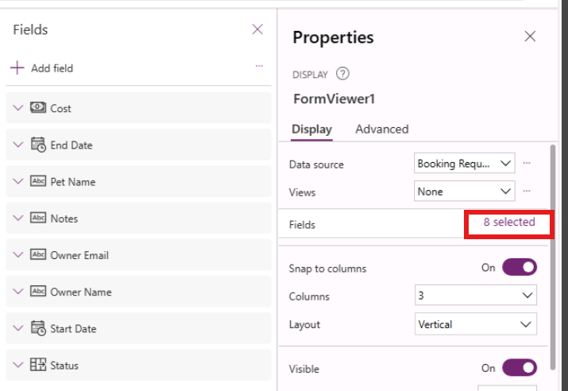

---
lab:
  title: "Lab\_6: Formulare"
  module: 'Module 6: Write data in a Power Apps canvas app'
---

# Übungslab 6: Formulare

In dieser Übung verwenden Sie Formulare zum Erstellen und Bearbeiten von Datensätzen in einer Datenquelle.

## Lernziele

- So fügen Sie Bildschirme hinzu
- So navigieren Sie zwischen Bildschirmen
- So verwenden Sie ein Formular zum Erstellen eines Datensatzes in einer Datenquelle
- So verwenden Sie ein Formular zum Bearbeiten eines Datensatzes in einer Datenquelle
- So löschen Sie einen Datensatz aus einer Datenquelle
- So verknüpfen Sie ein Formular mit einem Katalog

## Weiterführende Schritte des Lab

- Erstellen neuer Bildschirme
- Navigieren zu einem Bildschirm, wenn ein Datensatz in einem Katalog ausgewählt ist
- Zwischen den Bildschirmen navigieren
- Anzeigen eins Datensatzes mit einem Formular
- Datensatz löschen
- Bearbeiten eines Datensatzes mit einem Formular
- Erstellen eines neuen Datensatzes mit einem Formular
  
## Voraussetzungen

- Sie müssen **Lab 5: Externe Daten** abgeschlossen haben.

## Ausführliche Schritte

## Übung 1: Hinzufügen von Bildschirmen und der Navigation

### Aufgabe 1.1: Bearbeiten der App

1. Navigieren Sie zum Power Apps Maker-Portal `https://make.powerapps.com`.

1. Stellen Sie sicher, dass Sie sich in der Umgebung **Dev One** befinden.

1. Wählen Sie im linken Navigationsmenü die Registerkarte **Apps** aus.

1. Wählen Sie die **Buchungsanfrage-App**, die Befehle (**...**) und dann **Bearbeiten > Auf der neuen Registerkarte bearbeiten** aus.


### Aufgabe 1.2: Hinzufügen von Bildschirmen

1. Wählen Sie im Menü für die App-Erstellung **Strukturansicht** aus.

1. Wählen Sie auf der Aktionsleiste in Power Apps Studio **Neuer Bildschirm** aus.

    

1. Wählen Sie **Leer** aus.

1. Ändern Sie den Bildschirmnamen in `EditScreen`.

1. Wählen Sie auf der Aktionsleiste in Power Apps Studio **Neuer Bildschirm** aus.

1. Wählen Sie **Kopf- und Fußzeile** aus.

1. Ändern Sie den Bildschirmnamen in `DetailScreen`.


### Aufgabe 1.3: Hinzufügen der Navigation

1. Erweitern Sie in der **Strukturansicht** **BookingRequestList** im **MainScreen**.

1. Wählen Sie **NextArrow** in **BookingRequestList** aus.

1. Legen Sie die **OnSelect**-Eigenschaft von NextArrow in der Bearbeitungsleiste auf Folgendes fest:

    ```powerappsfl
    Collect(colRequests, ThisItem);Navigate(DetailScreen, ScreenTransition.Cover);
    ```

1. Wählen Sie **EditScreen** aus.

1. Wählen Sie im Menü für die App-Erstellung **Einfügen (+)** aus.

1. Erweitern Sie **Symbole**.

1. Wählen Sie **Pfeil „Zurück“** aus.

1. Legen Sie die Eigenschaft **OnSelect** für die Schaltfläche auf Folgendes fest:

    ```powerappsfl
    Back()
    ```

1. Wählen Sie in der **Strukturansicht** das Symbol aus, und wählen Sie die Befehle (**...**) und anschließend **Kopieren** aus.

1. Erweitern Sie **DetailScreen**.

1. Erweitern Sie **ScreenContainer**.

1. Wählen Sie **HeaderContainer** aus und anschließend die Befehle (**...**) aus, und wählen Sie **Einfügen** aus.


## Übung 2: Bildschirm „Details“

### Aufgabe 2.1: Hinzufügen des Anzeigeformulars

1. Wählen Sie im Menü für die App-Erstellung **Strukturansicht** aus.

1. Erweitern Sie **DetailScreen**.

1. Erweitern Sie **ScreenContainer1**.

1. Wählen Sie  **"MainContainer1**" aus.

1. Wählen Sie im Menü für die App-Erstellung **Einfügen (+)** aus.

1. Erweitern Sie **Eingabe**.

1. Wählen Sie **Anzeigeformular** aus.

    

1. Wählen Sie in den Eigenschaften von FormViewer **Buchungsanfragen** für **Datenquelle** aus.

1. Wählen Sie **2 ausgewählt** neben **Felder** aus.

    

1. Entfernen Sie **Erstellt am**, indem Sie die Auslassungspunkte (**...**) neben dem Feld und dann **Entfernen** auswählen.

1. Wählen Sie **+ Feld hinzufügen** und dann die folgenden Felder aus:

   1. Kosten
   1. Entscheidung
   1. Enddatum
   1. Besitzer-E-Mail
   1. Owner Name
   1. Startdatum

    

1. Wählen Sie **Hinzufügen** aus.

1. Ziehen Sie die Felder in den folgenden Ordner:

   1. Name des Haustiers
   1. Owner Name
   1. Besitzer-E-Mail
   1. Startdatum
   1. Enddatum
   1. Entscheidung
   1. Kosten

    

1. **Schließen** Sie den Bereich **Felder**.

1. Legen Sie die **Item**-Eigenschaft des Formularanzeige-Steuerelements in der Bearbeitungsleiste auf Folgendes fest:

    ```powerappsfl
    BookingRequestList.Selected
    ```

### Aufgabe 2.2: Hinzufügen der Bezeichnung

1. Wählen Sie im Menü für die App-Erstellung **Strukturansicht** aus.

1. Erweitern Sie **DetailScreen**.

1. Erweitern Sie **ScreenContainer1**.

1. Wählen Sie  **"FooterContainer1"** aus.

1. Wählen Sie **+** im Fußzeilencontainer aus.

    

1. Wählen Sie **Beschriftung** aus.

1. Legen Sie die Eigenschaft **Text** der Bezeichnung auf Folgendes fest:

    ```powerappsfl
    BookingRequestList.Selected.'Pet Name'
    ```

### Aufgabe 2.3: Hinzufügen der Schaltfläche „Löschen hinzufügen“

1. Wählen Sie im Menü für die App-Erstellung **Strukturansicht** aus.

1. Erweitern Sie **DetailScreen**.

1. Erweitern Sie **ScreenContainer1**.

1. Wählen Sie  **"FooterContainer1"** aus.

1. Wählen Sie im Menü für die App-Erstellung **Einfügen (+)** aus.

1. Wählen Sie die **Schaltfläche** aus.

1. Wählen Sie im Menü für die App-Erstellung **Strukturansicht** aus.

1. Benennen Sie die Schaltfläche in `Deletebtn` um.

1. Legen Sie die Eigenschaft **Text** für die Schaltfläche auf Folgendes fest:

    ```powerappsfl
    "Delete"
    ```

1. Legen Sie die Eigenschaft **OnSelect** für die Schaltfläche fest auf:

    ```powerappsfl
    Remove('Booking Requests', BookingRequestList.Selected); Back();
    ```

## Übung 3: Bearbeiten des Bildschirms

### Aufgabe 3.1: Hinzufügen von Formularen zum Bearbeiten

1. Wählen Sie im Menü für die App-Erstellung **Strukturansicht** aus.

1. Wählen Sie **EditScreen** aus.

1. Wählen Sie im Menü für die App-Erstellung **Einfügen (+)** aus.

1. Wählen Sie **Formular bearbeiten** aus.

1. Wählen Sie in den Eigenschaften des Formulars **Buchungsanfragen** für **Datenquelle** aus.

1. Wählen Sie **2 ausgewählt** neben **Felder** aus.

1. Entfernen Sie **Erstellt am**, indem Sie die Auslassungspunkte (**...**) neben dem Feld und dann **Entfernen** auswählen.

1. Wählen Sie **+ Feld hinzufügen** und dann die folgenden Felder aus:

   1. Kosten
   1. Enddatum
   1. Besitzer-E-Mail
   1. Owner Name
   1. Startdatum

1. Wählen Sie **Hinzufügen** aus.

1. Ziehen Sie die Felder in den folgenden Ordner:

   1. Name des Haustiers
   1. Owner Name
   1. Besitzer-E-Mail
   1. Startdatum
   1. Enddatum
   1. Kosten

1. **Schließen** Sie den Bereich **Felder**.

1. Legen Sie die Eigenschaft **Item** des Formularsteuerelements auf Folgendes fest:

    ```powerappsfl
    BookingRequestList.Selected
    ```

1. Wählen Sie im Menü für die App-Erstellung **Strukturansicht** aus.

1. Benennen Sie das Formular in `BookingRequestForm` um.

1. Legen Sie die Eigenschaften des Formulars wie folgt fest:

   1. X=`0`
   1. Y = `125`
   1. Höhe = `500`
   1. Breite=`Parent.Width`
   1. Spalten=`1`
   1. Layout=`Horizontal`

    


### Aufgabe 3.2: Hinzufügen der Schaltfläche „Senden“

1. Wählen Sie im Menü für die App-Erstellung **Strukturansicht** aus.

1. Wählen Sie **EditScreen** aus.

1. Wählen Sie im Menü für die App-Erstellung **Einfügen (+)** aus.

1. Wählen Sie die **Schaltfläche** aus.

1. Ziehen Sie die Schaltfläche unter das Formular.

1. Wählen Sie im Menü für die App-Erstellung **Strukturansicht** aus.

1. Benennen Sie die Schaltfläche in `Submitbtn` um.

1. Legen Sie die Eigenschaft **Text** für die Schaltfläche auf Folgendes fest:

    ```powerappsfl
    "Submit"
    ```

1. Legen Sie die Eigenschaft **OnSelect** für die Schaltfläche fest auf:

    ```powerappsfl
    SubmitForm(BookingRequestForm)
    ```

1. Wählen Sie **BookingRequestForm** aus.

1. Legen Sie die Eigenschaft **OnSuccess** für die Form auf Folgendes fest:

    ```powerappsfl
    Navigate(MainScreen, ScreenTransition.UnCover)
    ```

### Aufgabe 3.3: Hinzufügen der Navigation zum Bearbeitungsbildschirm

1. Wählen Sie im Menü für die App-Erstellung **Strukturansicht** aus.

1. Erweitern Sie **DetailScreen**.

1. Erweitern Sie **ScreenContainer**.

1. Wählen Sie **HeaderContainer** aus.

1. Wählen Sie im Menü für die App-Erstellung **Einfügen (+)** aus.

1. Erweitern Sie **Symbole**.

1. Wählen Sie **Bearbeiten** aus.

1. Wählen Sie im Menü für die App-Erstellung **Strukturansicht** aus.

1. Benennen Sie das Symbol in `EditIcon` um.

1. Legen Sie die Eigenschaft **OnSelect** für die Schaltfläche auf Folgendes fest:

    ```powerappsfl
    Navigate(EditScreen, ScreenTransition.Cover)
    ```

### Aufgabe 3.4: Neuer Datensatz

1. Wählen Sie im Menü für die App-Erstellung **Strukturansicht** aus.

1. Wählen Sie **MainScreen** aus.

1. Wählen Sie im Menü für die App-Erstellung **Einfügen (+)** aus.

1. Erweitern Sie **Symbole**.

1. Wählen Sie **Hinzufügen** aus.

1. Wählen Sie im Menü für die App-Erstellung **Strukturansicht** aus.

1. Benennen Sie das Symbol in `NewIcon` um.

1. Legen Sie die Eigenschaften des Symbols wie folgt fest:

   1. X = `0`
   1. Y = `0`
   1. Höhe = `80`
   1. Breite=`80`
   1. Farbe=`Color.White`

1. Legen Sie die Eigenschaft **OnSelect** für die Schaltfläche auf Folgendes fest:

    ```powerappsfl
    NewForm(BookingRequestForm);Navigate(EditScreen, ScreenTransition.Cover)
    ```

1. Wählen Sie oben rechts in Power Apps Studio **Speichern** aus.

1. Wählen Sie oben links in der Befehlsleiste die Schaltfläche **<- Zurück** und dann **Verlassen** aus, um die App zu beenden.

