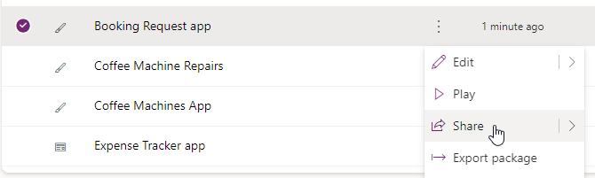
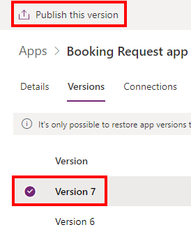

---
lab:
  title: "Lab\_7: Verwalten von Canvas-Apps"
  module: 'Module 7: Publish, share, and maintain a canvas app'
---

# Übungslab 7: Verwalten von Canvas-Apps

In diesem Lab verwalten Sie Ihre Canvas-App.

## Lernziele

- Gewusst wie: Freigeben von Canvas-Apps
- Gewusst wie: Verwalten von Canvas-App-Versionen
- Gewusst wie: Veröffentlichen von Canvas-Apps
- Gewusst wie: Exportieren von Canvas-Apps

## Weiterführende Schritte des Lab

- Canvas App gemeinsam nutzen
- Anzeigen von Canvas-App-Versionen
- Veröffentlichen einer Canvas-App
- Exportieren einer Canvas-App
  
## Voraussetzungen

- Sie müssen Folgendes abgeschlossen haben: **Lab 6: Formulare**

## Ausführliche Schritte

## Übung 1: Verwalten

### Aufgabe 1.1: Freigeben der Booking Request-App

1. Navigieren Sie zum Power Apps Maker-Portal unter <https://make.powerapps.com>.

1. Stellen Sie sicher, dass Sie sich in der Umgebung **Dev One** befinden.

1. Wählen Sie im linken Menü die Registerkarte **Apps** aus.

1. Wählen Sie die **Booking Request-App**, die Befehle (**...**) und dann **Freigeben** aus.

    

1. Geben Sie im Bereich „Freigeben“ `Everyone` ein, und wählen Sie **Jeder in Contoso** aus.

    

1. Wählen Sie **Teilen** aus.

1. **Schließen** Sie den Bereich „App freigeben“.

### Aufgabe 1.2: Veröffentlichen der Booking Request-App

1. Wählen Sie die **Booking Request-App**, die Befehle (**...**) und dann **Details** aus.

1. Wählen Sie die Registerkarte **Versionen** aus.

    

1. Wählen Sie die höchste Version aus.

    

1. Wählen Sie **Diese Version veröffentlichen**.

1. Wählen Sie erneut **Diese Version veröffentlichen** aus.

## Übung 2: Exportieren

### Aufgabe 2.1: Exportieren der Booking Request-App

1. Navigieren Sie zum Power Apps Maker-Portal unter <https://make.powerapps.com>.

1. Stellen Sie sicher, dass Sie sich in der Umgebung **Dev One** befinden.

1. Wählen Sie im linken Menü die Registerkarte **Apps** aus.

1. Wählen Sie die **Booking Request-App**, die Befehle (**...**) und dann **Paket exportieren** aus.

    

1. Geben Sie den Namen `Booking Request app` ein.

1. Wählen Sie unter **IMPORT SETUP** die Option **Aktualisieren** aus.

1. Wählen Sie **Als neu erstellen** und dann **Speichern** aus.

1. Wählen Sie **Exportieren**.

1. Warten Sie, bis das Paket erstellt und heruntergeladen worden ist. Dadurch wird eine ZIP-Datei im Ordner „Downloads“ erstellt.

### Aufgabe 2.2: Lokales Speichern der App

1. Wählen Sie im linken Menü die Registerkarte **Apps** aus.

1. Wählen Sie die **Booking Request-App**, die Befehle (**...**) und dann **Bearbeiten > Auf neuer Registerkarte bearbeiten** aus.

1. Wählen Sie das Dropdowncaret neben **Speichern** oben rechts in Power Apps Studio aus.

1. Wählen Sie **Kopie herunterladen** aus.

1. Wählen Sie **Herunterladen** aus.  Dadurch wird eine MSAPP-Datei im Ordner „Downloads“ erstellt.

1. Wählen Sie oben links in der Befehlsleiste die Schaltfläche **<- Zurück** und dann **Verlassen** aus, um die App zu beenden.
